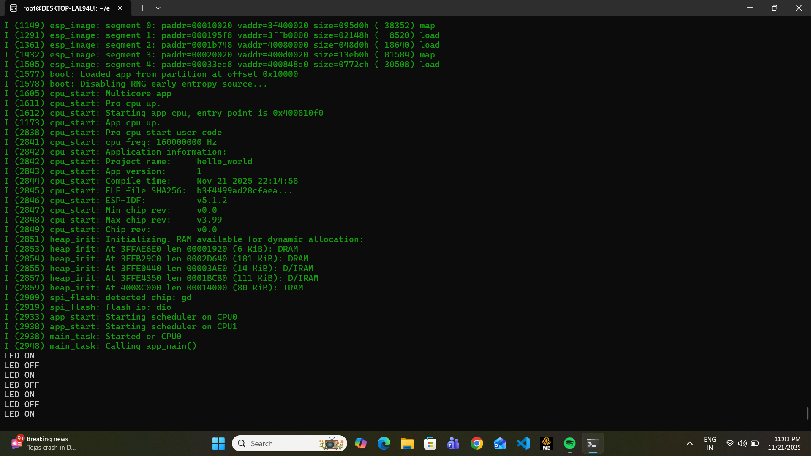
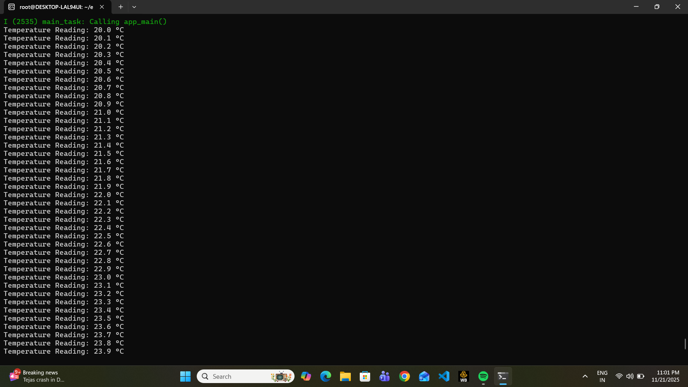

                                # ESP32 Emulation with QEMU - Final Report

*contact-oshw@fossee.in*Submitted By:** Bhavya Agarwal
**Student ID:**   23BAS10022
**University:**   VIT Bhopal University
**Course:**       Btech in Aerospace Eng
**Submitted To:** contact-oshw@fossee.in
**Date:**         (22/11/25)

                                  ## 1. System Information
- **OS:** Ubuntu 22.04 (WSL2)
- **QEMU Version:** 9.2.2 (Espressif fork) - **ESP-IDF Version:** v5.1.2

                                    ## 2. Setup Steps

### Prerequisites Installation

```bash
# System dependencies
sudo apt update && sudo apt install -y git wget flex bison gperf python3 \
  python3-pip python3-venv cmake ninja-build ccache libffi-dev libssl-dev \
  dfu-util libusb-1.0-0 build-essential

# QEMU compilation dependencies
sudo apt install -y libgcrypt20-dev libslirp-dev libglib2.0-dev \
  libpixman-1-dev libaio-dev libbluetooth-dev libcapstone-dev \
  libbrlapi-dev libbz2-dev libcap-ng-dev libcurl4-gnutls-dev

#ESP-IDF SETUP
git clone -b v5.1.2 --recursive https://github.com/espressif/esp-idf.git
cd esp-idf
./install.sh
. ./export.sh

# QUEMU COMPILATION PROCESS
git clone https://github.com/espressif/qemu.git
cd qemu
git submodule update --init --recursive
mkdir build && cd build

# Critical configuration for ESP32 support
CFLAGS="-Wno-deprecated-declarations" ../configure \
  --target-list=xtensa-softmmu \
  --enable-debug \
  --enable-gcrypt \
  --extra-cflags="-I/usr/local/include/slirp" \
  --extra-ldflags="-L/usr/local/lib"

make -j$(nproc)
sudo make install
```
                                  ##3. Challenges & Solutions

### Challenge 1: QEMU Crypto Modules
**Problem:** QEMU compilation failed at 65% with error: unknown type 'misc.esp32.rsa'
**Solution:** Installed libgcrypt20-dev and used --enable-gcrypt

### Challenge 2: Missing Dependencies
**Problem:**  Multiple compilation failures due to missing development libraries
**Solution:** Installed complete QEMU dependency list

### Challenge 3: Flash Image Creation
**Problem:** Direct .bin file execution failed with various errors
**Solution:** Used esptool.py merge_bin to create proper flash image

### Challenge 4:WSL2 Environmental Constraints
**Problem:**  Resource limitations and library version issues
**Solution:** Used conservative make -j2 instead of make -j$(nproc)

                                    ## 4. Demonstration

### Program 1: LED Blink 

**Description:** Emulates toggling a GPIO pin while printing 'LED ON' and 'LED OFF' messages to the console.

**code:**
```
#include <stdio.h>
#include "freertos/FreeRTOS.h"
#include "freertos/task.h"
#include "driver/gpio.h"

#define LED_GPIO 2

void app_main(void) {
    gpio_set_direction(LED_GPIO, GPIO_MODE_OUTPUT);
    int led_state = 0;
 
    while(1) {
        led_state = !led_state;
        gpio_set_level(LED_GPIO, led_state);
 
        if (led_state) {
            printf("LED ON\n");
        } else {
            printf("LED OFF\n");
        }
 
        vTaskDelay(1000 / portTICK_PERIOD_MS);
    }
}
```
 Successfully built and ran in QEMU

### Program 2: Simulated Temperature Sensor

**Description:** Simulates a temperature sensor by printing periodic randomized readings to the console.
**Code:**
```
#include <stdio.h>
#include "freertos/FreeRTOS.h"
#include "freertos/task.h"

void app_main(void) {
    int count = 0;
    while(1) {
        float temperature = 20.0 + (count % 100) * 0.1;
        printf("Temperature Reading: %.1f °C\n", temperature);
        count++;
        vTaskDelay(2000 / portTICK_PERIOD_MS);
    }
}
```
##BUILD AND EXECUTION PROCESS-

# Build the project
```
idf.py build
# Create flash image with proper structure
esptool.py --chip esp32 merge_bin -o build/flash_image.bin \
  --flash_mode dio --flash_freq 40m --flash_size 4MB \
  0x1000 build/bootloader/bootloader.bin \
  0x8000 build/partition_table/partition-table.bin \
  0x10000 build/hello_world.bin --fill-flash-size 4MB

# Execute in QEMU
qemu-system-xtensa -nographic -machine esp32 \
  -serial mon:stdio -drive file=build/flash_image.bin,if=mtd,format=raw
```
                                        ## 5. Reflection: Integration with Yaksh

This ESP32 emulation setup allows Yaksh to:
- Automatically test student ESP32 code submissions
- Run code safely in QEMU isolation
- Verify program behavior without physical hardware
- Scale to multiple students simultaneously

                                        ## 6. Demonstration Screenshots

# LED Blink Program


# Temperature Sensor Program  


Thankyou
Bhavya Agarwal

